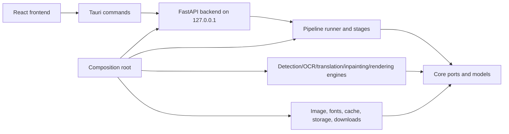

# vibecleaner

vibecleaner is a local desktop application for manga image translation and typesetting. It runs a Tauri desktop shell, a React frontend, and a local Python backend that handles image analysis, OCR, translation, inpainting, rendering, and export.

The application is designed for local workflows. Images are loaded from the user's machine, model files are stored under the app data directory, and translation providers are configured by the user.

## Architecture



- `frontend/`: React UI, state stores, API adapter, canvas/editor views.
- `desktop/src-tauri/`: Tauri shell, backend process launcher, command forwarding to the local API.
- `backend/api/`: FastAPI routes, dependency helpers, and use-case helpers (`api/use_cases/`). Routes receive application dependencies from the container instead of importing global services.
- `backend/core/`: application configuration snapshots, models, ports, state contracts, and the composition root in `backend/core/container.py`.
- `backend/pipeline/`: page-processing plans, runner, stages, strategies, validation, and provenance capture.
- `backend/engines/`: concrete detection, OCR, translation, inpainting, and rendering implementations and adapters behind core ports, plus shared engine domain types in `engines/common`.
- `backend/infrastructure/`: image, font, runtime (device/ONNX), storage, download, and asset helpers.
- `download_models.py`: downloads the core local model set into the user's app data directory.
- `scripts/verify-packaging.py`: checks packaging prerequisites without downloading large model assets.
- `scripts/build-runtime-sidecar.ps1`: builds the packaged backend sidecar from runtime-only dependencies.

The backend uses a composition-root pattern: `backend/main.py` creates the FastAPI app, calls `build_container()`, stores the container on `app.state`, and routes access it through `api.dependencies.get_container`. Pipeline code depends on core ports and explicit option DTOs rather than importing concrete engines directly. Strategies convert settings into stage options, validation produces structured pipeline issues, and provenance records stage execution metadata.

Backend dependency direction is intentionally one-way:

- `backend/api` may depend on `backend/core` and container-owned application services.
- `backend/pipeline` may depend on `backend/core` contracts, pipeline stages, strategies, validation, and provenance.
- `backend/engines` and `backend/infrastructure` adapt concrete libraries behind core ports.
- `backend/core/container.py` is the only place that wires API-facing services, pipeline stages, concrete engines, infrastructure, configuration, and project state together.

Routes must not import concrete engines, module-level project state, or module-level config singletons. The legacy `backend/services` package has been fully absorbed into `infrastructure`, `core`, `engines`, `pipeline`, and `api/use_cases`. Runtime state, settings, and the job manager are container-owned instances, so tests can assemble fake ports and run the pipeline without local model files.

The cleanup goal is that the application runs through the new architecture
only. Any remaining legacy state/model wrapper dependency is migration debt,
not an accepted end state.

See `docs/backend-dependency-contract.md` for the full import boundary,
composition root, dependency-set, and verification contract.

The v0.2 evolution guardrails are documented in
`docs/adr/0001-evolve-the-pipeline-core-without-a-full-rewrite.md`. Persisted
project, settings, artifact, checkpoint, and cache compatibility follows
`docs/schema-versioning-policy.md`.
Provider manifest, registration, and catalog rules are documented in
`docs/provider-extension-contract.md`.

## Translation Pipeline

The current page translation flow is:

1. Load image pages into the project.
2. Detect text and speech-bubble regions.
3. Run OCR on detected text regions.
4. Translate OCR text with the configured translation provider.
5. Build an inpainting mask from detected text areas.
6. Inpaint the source text.
7. Plan text layout for each bubble.
8. Render translated text back into the page.
9. Export the processed page or project output.

The frontend Translate action calls the backend `translate-all` pipeline for the selected page. Batch translation calls the backend batch route. Standalone Bubble Scan and manual region translation flows are not part of the current frontend workflow.

## Requirements

- Windows 10/11
- Node.js LTS with `node` and `npm` on `PATH`
- Rust stable with the MSVC toolchain, installed through `rustup`
- Python 3.10-3.12 with `python` on `PATH`
- Microsoft Edge WebView2 Runtime, usually already installed on Windows
- A repository-root Python virtual environment at `venv/`

Tauri requires `cargo` to be available on the shell `PATH`. If `npm run dev` fails at `cargo metadata`, install Rust from `https://rustup.rs`, restart the terminal, and confirm all required CLIs are visible:

```powershell
node --version
npm --version
cargo --version
rustc --version
python --version
```

## Dependency Sets

| Dependency set | Install command | Purpose |
| --- | --- | --- |
| Root Node package | `npm install` | Installs the Tauri CLI used by `npm run dev` and `npm run build`. |
| Frontend package | `npm --prefix frontend install` | Installs React, Vite, TypeScript, and the Tauri frontend API. |
| Backend runtime | `.\venv\Scripts\python.exe -m pip install -r requirements-runtime.txt` | Default local desktop backend and release sidecar runtime. |
| Optional Torch runtime | `.\venv\Scripts\python.exe -m pip install -r requirements-torch.txt` | Torch-backed OCR, inpainting, RT-DETR, or font-detection paths. |
| Sidecar build tools | installed by `npm run build:sidecar:runtime` | PyInstaller build environment for the packaged backend sidecar. |
| Full Python dev file | `requirements.txt` | Full development environment; avoid it for lean sidecar packaging. |

## Quick Start

Run these commands from the repository root.

Install the root Tauri CLI dependency and the React frontend dependencies.
Both are required for the desktop app; installing only `frontend/` is not enough.

```powershell
npm install
npm --prefix frontend install
```

Create the Python environment in the repository root. The Tauri dev launcher
looks for this exact `venv` folder when it starts `backend/main.py`.

```powershell
python -m venv venv
.\venv\Scripts\python.exe -m pip install -U pip
.\venv\Scripts\python.exe -m pip install -r requirements-runtime.txt
```

For the default ONNX-backed local workflow, `requirements-runtime.txt` is enough to start the desktop app. Install Torch only when you need Torch-backed OCR, inpainting, RT-DETR, or font-detection paths:

```powershell
.\venv\Scripts\python.exe -m pip install -r requirements-torch.txt
```

### NVIDIA CUDA acceleration

The runtime requirements install the CPU build of ONNX Runtime by default so
the app works on machines without NVIDIA hardware. To use CUDA for the ONNX
detection, OCR, and LaMa inpainting paths on Windows, replace that package in
the same virtual environment with the GPU build:

```powershell
.\venv\Scripts\python.exe -m pip uninstall -y onnxruntime
.\venv\Scripts\python.exe -m pip install --upgrade "onnxruntime-gpu[cuda,cudnn]"
```

Restart the app after installation and verify that CUDA is available:

```powershell
.\venv\Scripts\python.exe -c "import onnxruntime as ort; print(ort.__version__); print(ort.get_available_providers())"
```

The output must include `CUDAExecutionProvider`. If it is absent, check that
the NVIDIA driver is installed with `nvidia-smi`, then reinstall the GPU
package in the repository `venv`. The application intentionally falls back to
`CPUExecutionProvider` when CUDA is unavailable.

To verify actual GPU inference with the locally downloaded detection and LaMa
models, run:

```powershell
.\venv\Scripts\python.exe scripts\verify_gpu_runtime.py
```

The command reports each ONNX session's providers and one inference duration;
both sessions must list `CUDAExecutionProvider`.

The GPU wheel uses CUDA 12.x by default and requires compatible CUDA/cuDNN
runtime libraries. See the [ONNX Runtime installation guide](https://onnxruntime.ai/docs/install/)
and [CUDA Execution Provider requirements](https://onnxruntime.ai/docs/execution-providers/CUDA-ExecutionProvider.html)
for compatibility details.

Download local models. The minimal profile is the fastest way to get the app
running; use the full profile only when you need every local model path.

```powershell
.\venv\Scripts\python.exe download_models.py --minimal
```

```powershell
.\venv\Scripts\python.exe download_models.py
```

Start the desktop app. This is the normal development command. `npm run dev`
runs `tauri dev`; Tauri starts the Vite frontend through
`desktop/src-tauri/tauri.conf.json` and launches the Python backend from
`.\venv\Scripts\python.exe`.

```powershell
npm run dev
```

The frontend API client currently talks through Tauri commands. Running Vite by
itself opens a browser-only frontend without the backend launcher or Tauri
command bridge, so it is only useful for static UI work that does not call
backend or desktop APIs.

```powershell
npm --prefix frontend run dev
```

Release sidecar builds use a separate `.venv-runtime` environment created by `scripts/build-runtime-sidecar.ps1`. Do not install sidecar build dependencies into `venv` unless you need them for local packaging experiments.

## Commands

| Command | Description |
| --- | --- |
| `npm run dev` | Start Tauri development mode. Requires Rust/Cargo and the Python backend environment. |
| `npm run build` | Build the Tauri desktop app. Requires a packaged backend sidecar. |
| `npm run build:sidecar:runtime` | Build the Python backend sidecar from `requirements-runtime.txt`. |
| `npm run sync-version` | Sync the root app version into app metadata files. |
| `npm run verify:packaging` | Check sidecar, bundled font, and model registry metadata. |
| `npm run verify:packaging:models` | Also require local model files to exist and pass checksum checks. |
| `.\venv\Scripts\python.exe download_models.py` | Download the full core model profile. |
| `.\venv\Scripts\python.exe download_models.py --minimal` | Download the minimal detector/OCR profile. |
| `npm --prefix frontend run build` | Build the frontend only. |

## Runtime Notes

- The backend listens on `127.0.0.1` and is launched by Tauri in desktop mode.
- Local browser and local process access are not the same security boundary. Treat the local API as a loopback service for the desktop app, not as a network service.
- Translation provider credentials are configured in app settings. Do not commit local settings or API keys.
- Model files are downloaded into the user data directory and are not committed to the repository.
- Runtime sidecar builds use `.venv-runtime/`, `requirements-runtime.txt`, and PyInstaller excludes so optional Torch packages and model weights are not bundled into the installer.
- Release builds need a backend sidecar at `desktop/src-tauri/binaries/server-x86_64-pc-windows-msvc.exe`.
- Pretendard is bundled for Korean text rendering under `backend/infrastructure/assets/fonts/`.

## Release Packaging

Build the backend sidecar from a clean runtime-only environment:

```powershell
npm run build:sidecar:runtime
npm run verify:packaging
npm run build
```

Do not build the sidecar from `venv/` if that environment contains optional packages such as Torch, torchvision, spaCy, or notebook tooling. PyInstaller can detect imports even when they are only used by optional code paths, which inflates the sidecar. The runtime sidecar script creates `.venv-runtime/`, installs `requirements-runtime.txt`, excludes optional Torch modules, and copies the generated server to `desktop/src-tauri/binaries/server-x86_64-pc-windows-msvc.exe`.

Model files are external runtime assets. They are resolved through `ModelDownloader` and saved under the platform-specific user data directory, for example `%LOCALAPPDATA%\vibecleaner\models` on Windows. Use `download_models.py` only to pre-warm a local machine; do not add downloaded model folders to Tauri resources.

## License

This repository is licensed under the Apache License, Version 2.0. See `LICENSE`.

Third-party source code, model files, fonts, and services keep their own licenses and terms. See `NOTICE` and the upstream projects/model cards before redistributing packaged builds with bundled assets.

## Acknowledgements

This project uses or adapts work from the following projects and model sources:

- `ogkalu2/comic-translate`: upstream application and pipeline reference, Apache-2.0.
- `kha-white/manga-ocr`: Japanese OCR model/code source used by the Manga OCR path.
- `PaddlePaddle/PaddleOCR` and RapidOCR model exports: PPOCR detection/recognition models and dictionaries.
- `kakaobrain/pororo` and related BrainOCR/CRAFT assets: optional Korean OCR path.
- `Sanster/lama-cleaner` / IOPaint: inpainting helper/schema references.
- Sanster model releases and `ogkalu` Hugging Face model repositories: inpainting, detection, OCR, and ONNX model artifacts used by the downloader.
- `gyrojeff/YuzuMarker.FontDetection` and `ogkalu/yuzumarker-font-detection-onnx`: font attribute detection model sources.
- CPython `textwrap.py`: reference for the local hyphen-aware text wrapping helper.
- Pretendard: bundled Korean font, SIL Open Font License 1.1.

Translation providers such as Ollama, OpenAI-compatible endpoints, OpenAI, DeepL, Google Translate, Papago, Anthropic, and Baidu are optional runtime integrations. Their APIs and models are governed by the user's configuration and the providers' own terms.
