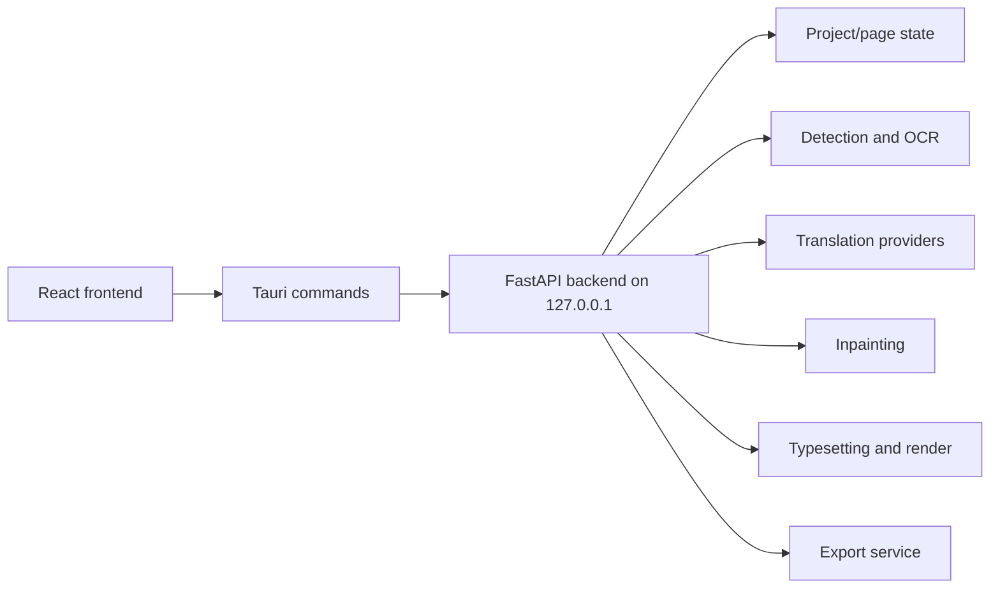

# vibecleaner

vibecleaner is a local desktop application for manga image translation and typesetting. It runs a Tauri desktop shell, a React frontend, and a local Python backend that handles image analysis, OCR, translation, inpainting, rendering, and export.

The application is designed for local workflows. Images are loaded from the user's machine, model files are stored under the app data directory, and translation providers are configured by the user.

## Architecture



- `frontend/`: React UI, state stores, API adapter, canvas/editor views.
- `desktop/src-tauri/`: Tauri shell, backend process launcher, command forwarding to the local API.
- `backend/`: FastAPI routes, project state, image processing services, OCR/detection/inpainting/rendering pipeline.
- `backend/modules/`: model wrappers and lower-level image/OCR/rendering utilities.
- `download_models.py`: downloads the core local model set used by detection and OCR.
- `scripts/verify-packaging.py`: checks packaging prerequisites without downloading large model assets.

## Translation Pipeline

The current page translation flow is:

1. Load image pages into the project.
2. Detect text and speech-bubble regions.
3. Run OCR on detected text regions.
4. Translate OCR text with the configured translation provider.
5. Build an inpainting mask from detected text areas.
6. Inpaint the source text.
7. Plan text layout for each bubble.
8. Render translated text back into the page.
9. Export the processed page or project output.

The frontend Translate action calls the backend `translate-all` pipeline for the selected page. Batch translation calls the backend batch route. Standalone Bubble Scan and manual region translation flows are not part of the current frontend workflow.

## Requirements

- Windows
- Node.js and npm
- Rust and Cargo, installed through `rustup`
- Python 3.10+
- A Python virtual environment at `venv/`

Tauri requires `cargo` to be available on the shell `PATH`. If `npm run dev` fails at `cargo metadata`, install Rust from `https://rustup.rs`, restart the terminal, and confirm:

```powershell
cargo --version
rustc --version
```

## Quick Start

Install JavaScript dependencies:

```powershell
npm install
npm --prefix frontend install
```

Create and prepare the Python environment:

```powershell
python -m venv venv
.\venv\Scripts\python.exe -m pip install -U pip
.\venv\Scripts\python.exe -m pip install -r requirements.txt
.\venv\Scripts\python.exe -m pip install -e .
```

> **Note:** `requirements.txt` includes all core and optional Python dependencies. If you do not need PyTorch-based models (inpainting, Manga OCR torch path, font detection), you can remove the `torch`, `torchvision`, `torchmetrics`, and `pytorch-lightning` lines from `requirements.txt` before installing.

Download the standard local models:

```powershell
.\venv\Scripts\python.exe download_models.py
```

Start the desktop app in development mode:

```powershell
npm run dev
```

## Commands

| Command | Description |
| --- | --- |
| `npm run dev` | Start Tauri development mode. Requires Rust/Cargo and the Python backend environment. |
| `npm run build` | Build the Tauri desktop app. Requires a packaged backend sidecar. |
| `npm run sync-version` | Sync the root app version into app metadata files. |
| `npm run verify:packaging` | Check sidecar, bundled font, and model registry metadata. |
| `npm run verify:packaging:models` | Also require local model files to exist and pass checksum checks. |
| `.\venv\Scripts\python.exe download_models.py` | Download the full core model profile. |
| `.\venv\Scripts\python.exe download_models.py --minimal` | Download the minimal detector/OCR profile. |
| `npm --prefix frontend run build` | Build the frontend only. |

## Runtime Notes

- The backend listens on `127.0.0.1` and is launched by Tauri in desktop mode.
- Local browser and local process access are not the same security boundary. Treat the local API as a loopback service for the desktop app, not as a network service.
- Translation provider credentials are configured in app settings. Do not commit local settings or API keys.
- Model files are downloaded into the user data directory and are not committed to the repository.
- Release builds need a backend sidecar at `desktop/src-tauri/binaries/server-x86_64-pc-windows-msvc.exe`.
- Pretendard is bundled for Korean text rendering under `backend/app/assets/fonts/`.

## License

This repository is licensed under the Apache License, Version 2.0. See `LICENSE`.

Third-party source code, model files, fonts, and services keep their own licenses and terms. See `NOTICE` and the upstream projects/model cards before redistributing packaged builds with bundled assets.

## Acknowledgements

This project uses or adapts work from the following projects and model sources:

- `ogkalu2/comic-translate`: upstream application and pipeline reference, Apache-2.0.
- `kha-white/manga-ocr`: Japanese OCR model/code source used by the Manga OCR path.
- `PaddlePaddle/PaddleOCR` and RapidOCR model exports: PPOCR detection/recognition models and dictionaries.
- `kakaobrain/pororo` and related BrainOCR/CRAFT assets: optional Korean OCR path.
- `Sanster/lama-cleaner` / IOPaint: inpainting helper/schema references.
- Sanster model releases and `ogkalu` Hugging Face model repositories: inpainting, detection, OCR, and ONNX model artifacts used by the downloader.
- `gyrojeff/YuzuMarker.FontDetection` and `ogkalu/yuzumarker-font-detection-onnx`: font attribute detection model sources.
- CPython `textwrap.py`: reference for the local hyphen-aware text wrapping helper.
- Pretendard: bundled Korean font, SIL Open Font License 1.1.

Translation providers such as Ollama, OpenAI-compatible endpoints, OpenAI, DeepL, Google Translate, Papago, Anthropic, and Baidu are optional runtime integrations. Their APIs and models are governed by the user's configuration and the providers' own terms.
