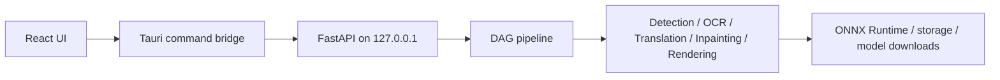

# vibecleaner 개발 및 빌드 가이드

[한국어](development-guide.ko.md) · [English](development-guide.md) · [사용자 안내로 돌아가기](../README.md)

이 문서는 소스 코드로 앱을 실행하거나 패키징하려는 개발자를 위한 문서입니다. 일반적인 앱 사용법은 [README](../README.md)를 확인하세요.

## 기술 구성

- Windows 데스크톱 셸: Tauri 2 / Rust
- 사용자 인터페이스: React 19 / TypeScript / Vite
- 로컬 백엔드: Python / FastAPI
- 이미지 추론: ONNX Runtime
- 주요 처리 단계: 검출 → OCR → 번역 → 인페인팅 → 레이아웃 → 렌더링



## 요구 사항

- Windows 10 또는 11
- Node.js LTS와 npm
- Rust stable 및 MSVC 툴체인
- Python 3.10~3.12
- Microsoft Edge WebView2 Runtime

PowerShell에서 다음 명령이 모두 실행되는지 확인합니다.

```powershell
node --version
npm --version
cargo --version
rustc --version
python --version
```

## 개발 환경 설치

저장소 루트에서 실행합니다.

```powershell
npm install
npm --prefix frontend install
python -m venv venv
.\venv\Scripts\python.exe -m pip install -U pip
.\venv\Scripts\python.exe -m pip install -r requirements-runtime.txt
```

현재 저장된 설정에 필요한 모델을 미리 내려받으려면 다음 명령을 실행합니다.

```powershell
.\venv\Scripts\python.exe download_models.py
```

경량 호환 세트는 `--minimal`, 모든 기본 등록 모델은 `--all`을 사용합니다. 모델은 저장소가 아니라 Windows 사용자 데이터 디렉터리의 `%LOCALAPPDATA%\vibecleaner\models`에 저장됩니다. 지원 모델 구조와 사용자 ONNX 검색 규칙은 [모델 가이드](model-guide.ko.md)를 참고하세요.

## 개발 모드 실행

```powershell
npm run dev
```

이 명령은 Tauri, Vite, 로컬 Python 백엔드를 함께 시작합니다. `npm --prefix frontend run dev`만 실행하면 브라우저 UI만 열리므로 Tauri 명령과 백엔드 기능은 동작하지 않습니다.

## NVIDIA GPU 사용

기본 의존성은 CPU용 ONNX Runtime입니다. CUDA를 사용하려면 같은 `venv`에서 런타임을 교체합니다.

```powershell
.\venv\Scripts\python.exe -m pip uninstall -y onnxruntime
.\venv\Scripts\python.exe -m pip install --upgrade "onnxruntime-gpu[cuda,cudnn]"
```

설치 후 앱을 다시 시작하고 공급자를 확인합니다.

```powershell
.\venv\Scripts\python.exe -c "import onnxruntime as ort; print(ort.get_available_providers())"
.\venv\Scripts\python.exe scripts\verify_gpu_runtime.py
```

출력에 `CUDAExecutionProvider`가 없다면 NVIDIA 드라이버와 CUDA/cuDNN 런타임 설치를 확인하세요. CUDA를 사용할 수 없으면 앱은 CPU로 폴백합니다.

## 테스트와 정적 검증

```powershell
.\venv\Scripts\python.exe -m pytest -q
npm --prefix frontend run build
npm --prefix frontend run lint
```

전역 Python을 사용하는 환경에서는 첫 명령의 실행 파일만 `python`으로 바꿀 수 있습니다.

## 패키징

백엔드 sidecar를 먼저 만든 뒤 Tauri 앱을 빌드합니다.

```powershell
npm run build:sidecar:runtime
npm run verify:packaging
npm run build
```

sidecar 빌드 스크립트는 별도 `.venv-runtime`을 만들고 `requirements-runtime.txt`만 설치합니다. 생성된 실행 파일은 `desktop/src-tauri/binaries/server-x86_64-pc-windows-msvc.exe`에 복사됩니다. 모델 파일은 설치 프로그램에 포함하지 않고 실행 시 별도로 내려받습니다.

## 주요 명령

| 명령 | 용도 |
| --- | --- |
| `npm run dev` | 전체 데스크톱 개발 환경 실행 |
| `npm --prefix frontend run build` | 프런트엔드 타입 검사 및 빌드 |
| `npm run build:sidecar:runtime` | Python 백엔드 sidecar 빌드 |
| `npm run verify:packaging` | 폰트, sidecar, 모델 등록 정보 검사 |
| `npm run verify:packaging:models` | 로컬 모델 파일과 체크섬까지 검사 |
| `npm run build` | Tauri 배포 앱 빌드 |
| `npm run sync-version` | 앱 버전 메타데이터 동기화 |

## 디렉터리 구조

- `frontend/`: React UI, 상태, 캔버스 및 API 어댑터
- `desktop/src-tauri/`: Tauri 셸, 창 관리, 백엔드 실행 및 명령 전달
- `backend/api/`: FastAPI 라우트와 유스케이스 진입점
- `backend/core/`: 설정, 도메인 모델, 포트, 프로젝트 상태, composition root
- `backend/pipeline/`: DAG 실행기, 단계, 품질 판단, 검증, 텔레메트리
- `backend/engines/`: 검출, OCR, 번역, 인페인팅, 렌더링 구현
- `backend/infrastructure/`: ONNX 런타임, 이미지, 저장소, 모델 다운로드, 글꼴
- `tests/`: 백엔드 단위 및 회귀 테스트
- `scripts/`: 패키징과 런타임 검증 도구

## 런타임과 데이터

- 백엔드는 데스크톱 모드에서 `127.0.0.1`에만 바인딩됩니다.
- 설정, OCR 캐시, 번역 메모리, 텔레메트리는 사용자 앱 데이터 디렉터리에 저장됩니다.
- 모델 파일은 `%LOCALAPPDATA%\vibecleaner\models`에 저장됩니다.
- API 키와 로컬 설정 파일을 저장소에 커밋하지 마세요.
- Pretendard 글꼴은 `backend/infrastructure/assets/fonts/`에서 패키징됩니다.

## 아키텍처 규칙

`backend/core/container.py`가 구체 구현을 조립하는 composition root입니다. API 라우트는 전역 엔진이나 프로젝트 상태를 직접 가져오지 않고 컨테이너의 의존성을 사용해야 합니다. 파이프라인은 core port와 명시적 옵션 객체를 통해 엔진을 호출합니다.

세부 규칙은 다음 문서를 참고하세요.

- [백엔드 의존성 규칙](backend-dependency-contract.md)
- [프로바이더 확장 규칙](provider-extension-contract.md)
- [스키마 버전 정책](schema-versioning-policy.md)
- [파이프라인 ADR](adr/0001-evolve-the-pipeline-core-without-a-full-rewrite.md)
- [Shadow benchmark](shadow-benchmark.md)
- [모델 선택 및 ONNX 추가 가이드](model-guide.ko.md)

## 라이선스

프로젝트 코드는 Apache License 2.0입니다. 제3자 모델, 글꼴, 번역 서비스는 각 라이선스와 약관을 따릅니다. 재배포 전 [NOTICE](../NOTICE)와 해당 모델 카드를 확인하세요.
