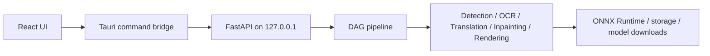

# vibecleaner development and build guide

[한국어](development-guide.ko.md) · [English](development-guide.md) · [Back to the user guide](../README.en.md)

This document is for contributors who want to run or package vibecleaner from source. See the [user guide](../README.en.md) for normal app usage.

## Technology overview

- Desktop shell: Tauri 2 / Rust
- User interface: React 19 / TypeScript / Vite
- Local backend: Python / FastAPI
- Image inference: ONNX Runtime
- Main pipeline: detection → OCR → translation → inpainting → layout → rendering



## Prerequisites

- Windows 10 or 11
- Node.js LTS and npm
- Rust stable with the MSVC toolchain
- Python 3.10–3.12
- Microsoft Edge WebView2 Runtime

Verify the toolchain in PowerShell:

```powershell
node --version
npm --version
cargo --version
rustc --version
python --version
```

## Install the development environment

Run these commands from the repository root:

```powershell
npm install
npm --prefix frontend install
python -m venv venv
.\venv\Scripts\python.exe -m pip install -U pip
.\venv\Scripts\python.exe -m pip install -r requirements-runtime.txt
```

Pre-download the models required by the currently saved settings if desired:

```powershell
.\venv\Scripts\python.exe download_models.py
```

Use `--minimal` for the lightweight compatibility set or `--all` for every built-in registered model. Models are stored outside the repository under `%LOCALAPPDATA%\vibecleaner\models`. See the [model guide](model-guide.md) for supported layouts and custom ONNX discovery rules.

## Run in development mode

```powershell
npm run dev
```

This starts Tauri, Vite, and the local Python backend together. Running `npm --prefix frontend run dev` alone opens a browser-only UI without the Tauri command bridge or backend launcher.

## NVIDIA GPU acceleration

The default requirements use CPU ONNX Runtime. Replace it in the same virtual environment to enable CUDA:

```powershell
.\venv\Scripts\python.exe -m pip uninstall -y onnxruntime
.\venv\Scripts\python.exe -m pip install --upgrade "onnxruntime-gpu[cuda,cudnn]"
```

Restart the app and verify the active providers:

```powershell
.\venv\Scripts\python.exe -c "import onnxruntime as ort; print(ort.get_available_providers())"
.\venv\Scripts\python.exe scripts\verify_gpu_runtime.py
```

The output should include `CUDAExecutionProvider`. Check the NVIDIA driver and CUDA/cuDNN runtime when it does not. The application falls back to CPU when CUDA is unavailable.

## Tests and static checks

```powershell
.\venv\Scripts\python.exe -m pytest -q
npm --prefix frontend run build
npm --prefix frontend run lint
```

You may replace the first executable with `python` when intentionally using a global environment.

## Packaging

Build the backend sidecar before the Tauri application:

```powershell
npm run build:sidecar:runtime
npm run verify:packaging
npm run build
```

The sidecar script creates a separate `.venv-runtime`, installs `requirements-runtime.txt`, and copies the executable to `desktop/src-tauri/binaries/server-x86_64-pc-windows-msvc.exe`. Model files remain external and download on demand.

## Command reference

| Command | Purpose |
| --- | --- |
| `npm run dev` | Run the complete desktop development environment |
| `npm --prefix frontend run build` | Type-check and build the frontend |
| `npm run build:sidecar:runtime` | Build the Python backend sidecar |
| `npm run verify:packaging` | Verify sidecar, font, and model registry metadata |
| `npm run verify:packaging:models` | Also verify local model files and checksums |
| `npm run build` | Build the distributable Tauri app |
| `npm run sync-version` | Synchronize application version metadata |

## Repository layout

- `frontend/`: React UI, state, canvas, and API adapter
- `desktop/src-tauri/`: Tauri shell, window management, backend launcher, and commands
- `backend/api/`: FastAPI routes and use-case entry points
- `backend/core/`: configuration, domain models, ports, project state, and composition root
- `backend/pipeline/`: DAG execution, stages, quality routing, validation, and telemetry
- `backend/engines/`: detection, OCR, translation, inpainting, and rendering implementations
- `backend/infrastructure/`: ONNX runtime, images, storage, downloads, and fonts
- `tests/`: backend unit and regression tests
- `scripts/`: packaging and runtime verification utilities

## Runtime and data notes

- The desktop backend binds to `127.0.0.1`.
- Settings, OCR cache, translation memory, and telemetry live in the user app-data directory.
- Model files live under `%LOCALAPPDATA%\vibecleaner\models`.
- Never commit API keys or local settings.
- Pretendard is packaged from `backend/infrastructure/assets/fonts/`.

## Architecture rules

`backend/core/container.py` is the composition root. API routes must receive container-owned dependencies instead of importing concrete engines or global project state. Pipeline code calls engines through core ports and explicit option objects.

See these documents for the full contracts:

- [Backend dependency contract](backend-dependency-contract.md)
- [Provider extension contract](provider-extension-contract.md)
- [Schema versioning policy](schema-versioning-policy.md)
- [Pipeline architecture decision](adr/0001-evolve-the-pipeline-core-without-a-full-rewrite.md)
- [Shadow benchmark](shadow-benchmark.md)
- [Model selection and custom ONNX guide](model-guide.md)

## License

The project code is licensed under Apache License 2.0. Third-party models, fonts, and translation services retain their own licenses and terms. Review [NOTICE](../NOTICE) and relevant model cards before redistribution.
